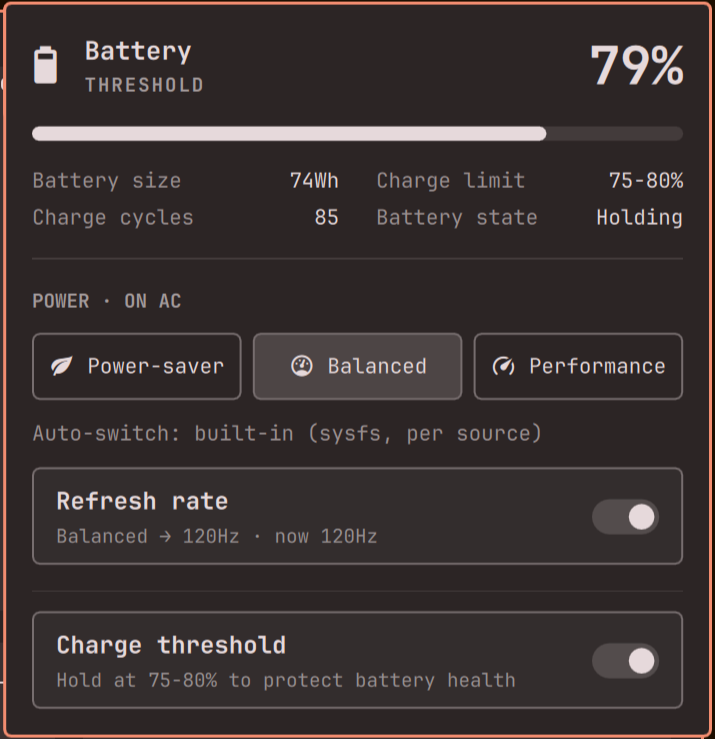
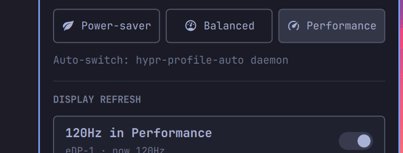
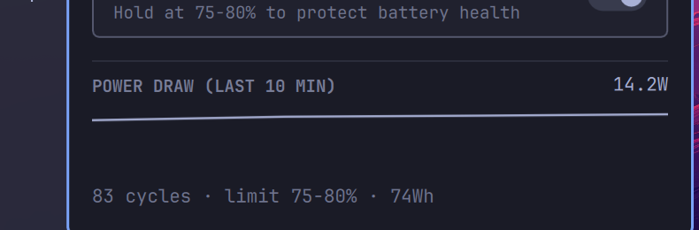

# Battery

Manual power profiles, charge cap, and drain history — in the bar.



Needs: Omarchy · laptop with UPower battery · no network, no sudo.

## What you get

- **Per-source power profiles** — one pill per profile, remembered separately for AC and battery.
- **Per-profile 120Hz toggle** — each profile keeps its own refresh rate.
- **Charge-threshold toggle** — hold at the firmware limit to protect battery health.
- **Drain sparkline** — 10 minutes of live watts plus a health line, no database.
- **Instant plug/unplug reaction** — UPower signal plus kernel uevents, with sysfs arbitration when UPower goes stale.


| Click | Action |
|---|---|
| Left click pill | Open / close the panel |
| Right click pill | Toggle percentage |
| Click profile pill | Set profile for the current source |
| 120Hz toggle | Set refresh rate for the active profile |
| Charge threshold toggle | Hold charge below the firmware limit |

## Screenshots

| Profiles + refresh | Charge threshold |
|---|---|
|  |  |

| Drain history | |
|---|---|
|  | |

## Requirements

Required (standard on Omarchy): `omarchy-battery-status`, `omarchy-power-present`, `omarchy-powerprofiles-list`, `omarchy-powerprofiles-set`, `omarchy-system-stats`, `hyprctl`, `gdbus`, `upower`, `udevadm`, `bash`.

Optional (not bundled): `hypr-profile-auto` and `hypr-refresh-auto` in `~/.local/bin`. The panel reports whether each daemon exists. Without them, auto-switch or Hz enforcement stay inert.

## Install

1. Add the plugin:

```
omarchy plugin add https://github.com/tymurbogach/battery.git --enable
```

2. Put it on the bar at the far right end (replaces `omarchy.power`):

```
omarchy bar move cyberdyne.battery --section right --index 99
```

Any large index lands last. To place it elsewhere, pick your own anchor instead:

```
omarchy bar move cyberdyne.battery --after omarchy.audio
omarchy bar move cyberdyne.battery --section right --index 0
```

3. Restart the shell and look right:

```
omarchy restart shell
```

## Usage

- Click the bar pill to open the panel, click a profile pill to set it for the current source.
- The header shows which source is active (`POWER · ON AC` or `POWER · ON BATTERY`).
- Flip the 120Hz toggle to set the rate for the active profile. The panel states when `hypr-refresh-auto` is unavailable.
- Flip Charge threshold only when the row is visible (hardware must report a threshold).
- The bottom graph needs the panel open for a few samples before it draws. It records only while discharging.
- If data goes stale, the panel shows a `STALE` banner with the last error instead of trusting old values.
- If sysfs disagrees with UPower, the banner shows `SYSFS ▸ … (UPower stale)` and sysfs wins. If the probe fails, the last valid source stays active.

## Configure

Settings live inline on the bar entry (via `updateEntryInline`):

| Key | Default | Purpose |
|---|---|---|
| `showPercentage` | `false` | Show `79%` on the bar pill |
| `hz_power-saver` | `60` | Refresh rate for power-saver |
| `hz_balanced` | `120` | Refresh rate for balanced |
| `hz_performance` | `120` | Refresh rate for performance |

Legacy keys `refreshAc` / `refreshBatt` (v0.1.0) are ignored since v0.2.0. They stay orphaned in `shell.json` and cause no error. Delete them by hand if you want a clean entry.

## How it works

- **Profiles**: `omarchy-powerprofiles-set <ac|battery> <profile>` on manual pick (writes the native state file). The optional `hypr-profile-auto` daemon (`~/.local/bin`, not bundled) polls `omarchy-power-present` (sysfs) every 5s and restores the remembered profile on cable change, logging to `~/.local/state/omarchy/powerprofiles/ac-watch.log`. Without it, picks still persist per source but nothing auto-switches on plug/unplug.
- **Instant reaction**: plug/unplug wakes the panel through the UPower `onBatteryChanged` signal plus kernel uevents (`udevadm monitor --subsystem-match=power_supply`, panel-open only, 500ms debounce). Every trigger runs one-shot `omarchy-power-present` (sysfs). Exit `0` means AC and exit `1` means battery. Other exits preserve the last valid source and show an error.
- **Refresh**: the toggle stores 60/120 per profile in settings and writes `~/.local/state/omarchy/toggles/hypr/refresh-override-hz`, which the optional `hypr-refresh-auto` daemon (not bundled) enforces (overriding its AC=120/battery=60 source logic). Rapid changes keep only the newest pending write. A profile change writes its Hz only after the profile command succeeds. Live rate shown read-only via `hyprctl monitors -j` (30s poll).
- **Threshold**: two plain-argv steps, no shell interpolation. First `upower -e` resolves the battery object path (prefers `battery_BAT0`, skips HID++ and line_power). Then `gdbus call` against `org.freedesktop.UPower` for `ChargeThresholdEnabled` read and `EnableChargeThreshold` write with that path.
- **Draw history**: reuses the `rate` field from every `omarchy-battery-status --shell` sample while effectively discharging (sysfs-arbitrated), in a rolling 600s window capped at 200 samples.
- **Polling**: CLI text fields refresh every 15s while the panel is open as safety net for missed signals. A 10s watchdog kills hung queries so the next tick recovers. Battery and profile failures track independently. Either source marks data `STALE` after 2 failures.
- **Settings**: `showPercentage`, `hz_power-saver`, `hz_balanced`, `hz_performance`. Stored inline on the bar entry via `updateEntryInline`.

## Known issues

- **Stale UPower AC record**: on this hardware UPower's `line_power_AC` can stop updating. The widget uses the sysfs probe for source-dependent UI, profile writes, and drain history. UPower can still report stale battery telemetry. A one-time `sudo systemctl restart upower` re-reads sysfs; if it recurs, it is an upstream UPower/udev event-delivery issue.

This listing is not a security audit or certification. The plugin runs unsandboxed inside `omarchy-shell`; every dependency, process, and file write above is public review surface.

## Update

```
omarchy plugin update cyberdyne.battery --yes
omarchy restart shell
```

## Remove

```
omarchy plugin remove cyberdyne.battery
```

Re-add `omarchy.power` to the bar if you want the stock widget back. Removal leaves the native `~/.local/state/omarchy/powerprofiles/` files untouched (they belong to Omarchy, not to this plugin).

Plugin-owned state: `~/.local/state/omarchy/toggles/hypr/refresh-override-hz` (one file, the per-profile Hz override). Retention: kept across reinstalls so your per-profile rates survive. Removal: the plugin never deletes it silently. Confirm, then run once if you no longer want per-profile rates:

```
rm -f ~/.local/state/omarchy/toggles/hypr/refresh-override-hz
```

(without it, `hypr-refresh-auto` falls back to 120Hz on AC / 60Hz on battery).

## Changelog

See [CHANGELOG.md](CHANGELOG.md).

## License

MIT — see [LICENSE](LICENSE).
